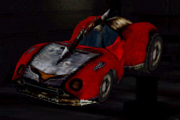

# Eagle MK4

Platform (hardware specs + ROS package) for building awesome autonomous RC robocars.

Inspired and inherited from [MIT racecar](https://mit-racecar.github.io/) and [RacecarJ](https://racecarj.com/).

# Installation

[Installation guide](docs/installation-guide.md)

# Components

| Component | Model | Comments |
| --------- | ----- | -------- |
| 1/10 RC chassis | [Hobbyking SCT Trooper 4x4](https://hobbyking.com/en_us/trooper-pro-4x4-1-10-brushless-sct-arr.html) | only chassis and brishless motor are used, any similar 1/10 chassis will fit |
| 2D Lidar | [YDLIDAR X4](https://www.robotshop.com/de/en/ydlidar-x4-360-laser-scanner.html) | |
| IMU | [SparkFun MPU-9250 9DoF Razor IMU M0](https://www.exp-tech.de/sensoren/beschleunigung/7879/sparkfun-mpu-9250-9dof-razor-imu-m0) | |
| Camera | [Logitech-C920](https://www.amazon.de/Logitech-C920-Webcam-Videogespr%C3%A4che-Stereo-Mikrofonen/dp/B006A2Q81M) | |
| VESC | [Turnigy SK8-ESC V4.12](https://hobbyking.com/en_us/turnigy-sk8-esc-v4-12-for-electric-skateboard-conversion-w-bec.html) | |
| Compute module  | [Jetson TX1](https://developer.nvidia.com/embedded/buy/jetson-tx1) | |
| SSD (Optional)| [SanDisk SSD 120GB](https://www.amazon.de/gp/product/B07621PNWC) + [SATA cable](https://www.amazon.de/gp/product/B001VBLM9K) | Jetson has only 16GB of disk by default |
| 10x USB 3.0 hub | [ORICO 40W 10 Ports USB 3.0 hub](https://www.amazon.de/gp/product/B075QZ88DM) | |
| Hobby glass | 2 x [25cm x 50cm x 4mm](https://www.amazon.de/70101022-Hobbyglas-Gr%C3%B6%C3%9Fe-transparent-Glasscheibe/dp/B00ZZPHZ08) | |
| Camera mount | 2 x [Camera Wall Mount](https://www.amazon.de/gp/product/B00CKE5FBS/) | |
| LiPo battery 3S | 2 x [ZIPPY Flightmax 5000mAh 3S1P 20C](https://hobbyking.com/en_us/zippy-flightmax-5000mah-3s1p-20c.html) | One for car, one for Jetson |
| LiPo voltage checker | [lipo voltage checker](https://hobbyking.com/en_us/hobbykingtm-lipo-voltage-checker-2s-8s.html) | |
| LiPo charger | [Turnigy Accucell-6 50W 6A Charger](https://hobbyking.com/en_us/turnigy-accucell-6-50w-6a-balancer-charger-lihv-capable.html) | Requires power supply DC 11-18V |
| M3 standoffs/nuts/etc. | [M3 Nylon Black Hex Screw Nut Spacer Standoff (260 pieces)](https://www.amazon.de/gp/product/B01MFF5XIC) |

Tools
- [Electro Screwdriver](https://www.amazon.de/gp/product/B01MR4JWO6)
- [Drill bits set](https://www.amazon.de/gp/product/B01D17N8CA)
- Hacksaw

# Misc

The name Eagle MK4 refers to a same name car from Carmageddon TDR 2000 game.

